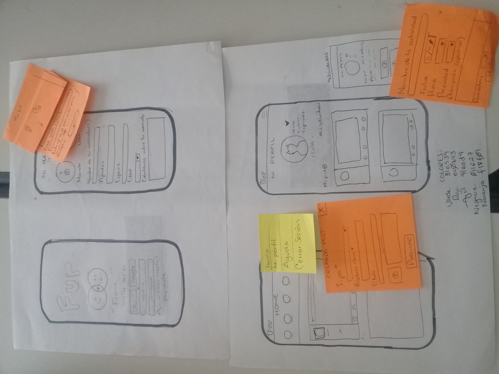

## Definición del producto

FUR es una red social pensada para personas que desean saber como cuidar mejor a sus mascotas así como compartir sus tips con la comunidad y recomendaciones de veterinarias/asociaciones. Esta aplicación te permitirá crear un perfil para ti y tu mascota con la finalidad de interactuar con otros dueños para compartir consejos, memes y curiosidades, además para ofrecer servicios para los animales.

## Benchmarking
Para tomar referencias, hicimos una revisión de las aplicaciones que están enfocadas en lo relacionado a las mascotas. Pudimos observar que su mayor enfoque es en la adopción y otras tantas, en cosas como una especie de "Tinder" y sólo unas cuantas en cuidados.
Algunas son:
-Rate my pets
-Animales sin hogar (ASH)
-Miwuki
-Mascomad
-Twindog

## Definición de usuarios
Nuestra idea fue pensada en todo tipo de personas que sean afines a los temas del cuidado de las mascotas en general y que tengan cosas que aportar a la demás gente para así crear una cultura de cuidado, dando consejos o tips, recomendando lugares Petfriendly, reportando o ayudando a localizar a las mascotas extraviadas y además, poder subir fotos, memes, étc.

Después de preguntar a personas con mascotas si utilizarían una red social con estos atributos, recibimos feedback positivo y que si la utilizarían.

FUR es para:
* Personas con mascotas

* Personas que desean mascotas

## ¿Qué problema resuelve Fur?
Encontrar información confiable y válidada por otros usuarios, compartir conocimientos con personas de tus mismos intereses, además de obtener beneficios por hacerlo. Finalmente brinda un espacio especial para esos seres tan importantes. 

## Prototipo de baja fidelidad
Nuestro prototipo de baja fidelidad, lo realizamos a partir de una lluvia de ideas y definiendo las secciones más importantes y más útiles para los usuarios, así como feedback de al menos cinco personas. Tomando en cuenta la funcionalidad, la practicidad y que pueda ser atractiva para ser visitada continuamente por los usuarios, permitiendo crear un perfil básico en donde aparezca también la información de las mascotas de los usuarios.

## Prototipo de Alta fidelidad
A partir de 3 feedback iterativos llegamos a la siguiente propuesta:
- Una pantalla de login (que permite al usuario iniciar sesión con sus datos/Facebook/Google)
- Una pantalla de registro (continuación de la anterior pantalla)
- Pantalla de la información del usuario, dónde podrá registrar a cualquier número de mascotas e incluso subir fotografías de ellas.
- Pantalla de actividades importantes del usuario con sus mascotas (vacunas, citas, salidas, el etc)
https://www.figma.com/file/ZLiehtcKzvRbtlNrS5FlEJ/Untitled?node-id=0%3A1
- Una pantalla donde podrán encontrar información variada de diferentes usarios (memes, veterinarias, animales pérdidos, tips para el cuidado de las mascotas y lugares Petfriendly).
- Una pantalla de perfil de usuario, donde podrá encontrar todas las publicaciones que ha realizado y editar su foto.

## Prototipo de alta fidelidad

## Historias de usuario

#### 1. Iniciar sesión u registrarse

Como usuario nuevo debo poder crear una cuenta nueva con mi correo electrónico y una contraseña. También debo de poder iniciar sesión con Facebook o con Google.

##### Criterios de aceptación:

- Si el mail o password no es válido, al momento de logearme, debo poder ver un mensaje de error.
- Debe ser visible si hay algún mensaje de error.
- Debo poder ver esta página de creación en Móviles y desktop (responsive).
- No debe necesitar recargar la página para crear una cuenta (SPA).

#### 2. Cerrar sesión

Como usuario nuevo debo poder cerrar sesión y regresarme a la pantalla de login.

##### Criterios de aceptación:
- Debo tener a la vista la opción de cerrar sesión en la barra de navegación o bien en una de las opciones del menú hamburguesa.
- Cuando de click en cerrar sesión debo regresar a la pantalla de Login.

#### 3. Agregar post nuevo
Como usuario debo poder crear un post nuevo desde mi perfil o bien, desde el home.

##### Criterios de aceptación:
- En home o desde mi perfil debo tener la opción de crear un post nuevo, con la opción clasificarlo y agregar una fotografía que lo acompañe.
#### 4. Borrar post
Como usario debo poder borrar post propios.

##### Criterios de aceptación:
- El post debe tener en su menú la opción de borrar.
- Cuando le de click en borrar debe aparecer un recuadro que confirme que quiero borrar dicho post.
- Cuando navegue no debo de volver a ver ese post borrado.
#### 5. Editar post
Como usuario debo poder editar post ya publicados.

##### Criterios de aceptación:
- El post debe tener en su menú la opción de editar.
- Cuando le de click en editar debe permitirme borrar y escribir nuevamente información sobre el mismo post.
- Cuando navegue debo poder ver mi post editado.
#### 6. Dar like a post
Como usario debo de poder ver post de otras personas y dar "like" a cualquiera de los post. 

##### Criterios de aceptación:

- Cada post debe tener la opción de dar like.
- El usuario debe poder dar like y que se vea reflejado en el post.
- Debe de ser solo un like por usuario.
#### 7. Comentar post
Como usuario debo de poder comentar cualquier post.
##### Criterios de aceptación:
- El post debe darte la opción de comentar algo.
- Una vez comentando debo de poder visualizar el comentario.
#### 8. Filtrar post
Como usuario estando en la página de home debo de poder filtrar los post que aparecen.
##### Criterios de aceptación:
- En home debo de tener un barra de navegación extra con las opciones de filtrado predeterminadas.
- Si selecciono una opción debo de saber en que pestaña estoy navegando.
- Una vez seleccionando una opción solo debo de ver post que cumplen con el criterio de filtrado.

